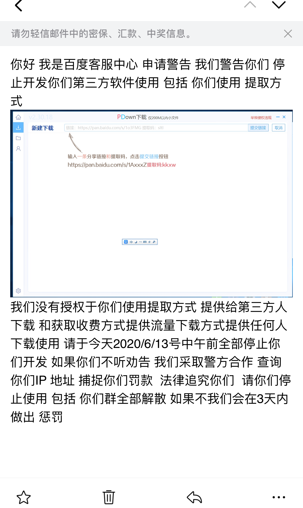

# 自6月13日起，PDown停止开发维护的公告

因自身原因，无力继续维护和开发PDown，已经于6月13日起关闭项目，并清理相关内容

# 自6月17日起，已由加百列接手维护，请到 https://github.com/forpdown/pdown

发件人：百度网盘客服中心 <3325598101@qq.com> 

> 你好 我是百度客服中心 申请警告 我们警告你们 停止开发你们第三方软件使用 包括 你们使用 提取方式

> 我们没有授权于你们使用提取方式 提供给第三方人下载 和获取收费方式提供流量下载方式提供任何人下载使用 请于今天2020/6/13号中午前全部停止你们开发 如果你们不听劝告 我们采取警方合作 查询你们IP 地址 捕捉你们罚款  法律追究你们  请你们停止使用 包括 你们群全部解散 如果不我们会在3天内做出 惩罚

